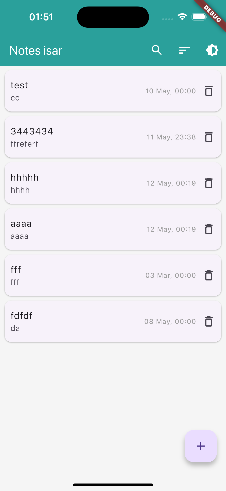
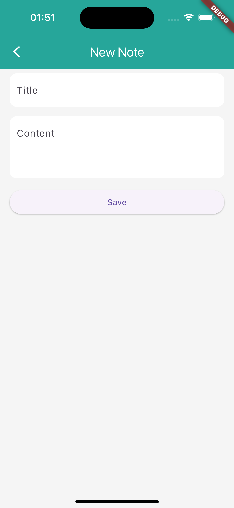
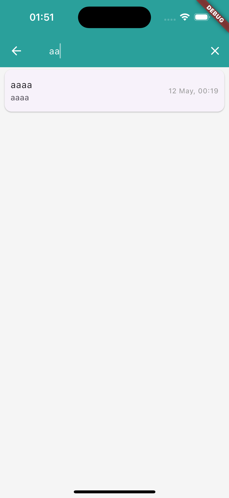
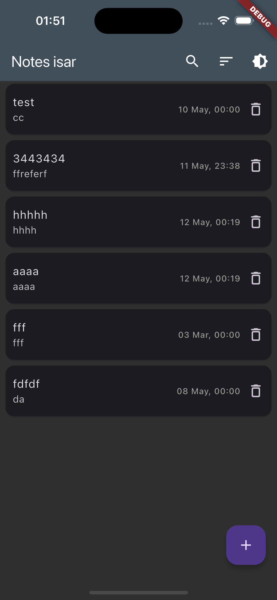
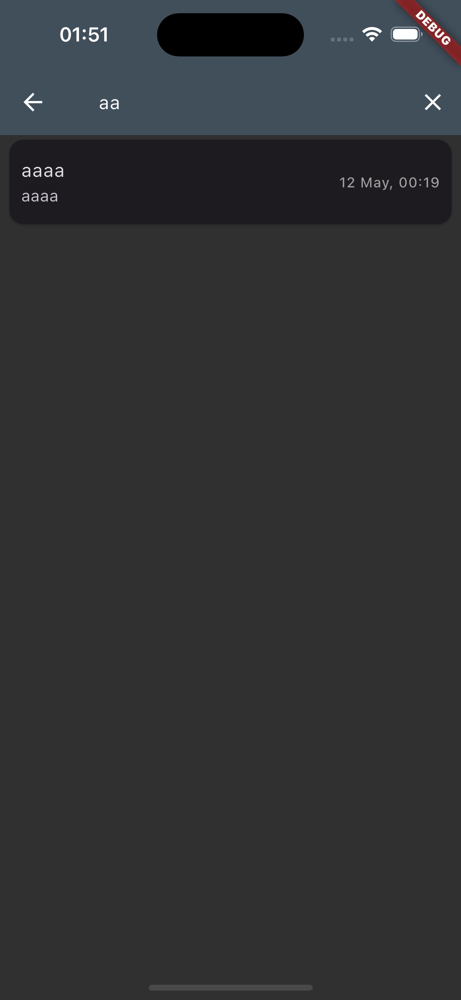
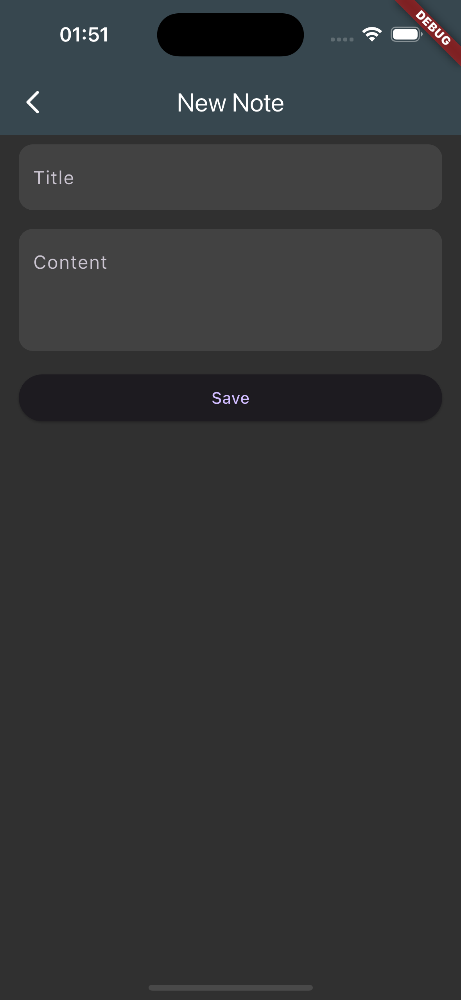

### **Установка и запуск**

1. Установите зависимости:

   ```flutter pub get```

2. Сгенерируйте модели Isar:

   ```flutter pub run build_runner build```

3. Запустите приложение:

   ```flutter run```

   Для удобства в **`launch.json`** добавлены пресеты запуска:

```json
{
  "version": "0.2.0",
  "configurations": [
    {
      "name": "Debug (Isar)",
      "request": "launch",
      "type": "dart",
      "program": "lib/main.dart",
      "args": ["--dart-define=NOTE_STORAGE_TYPE=isar"]
    },
    {
      "name": "Debug (Shared)",
      "request": "launch",
      "type": "dart",
      "program": "lib/main.dart",
      "args": ["--dart-define=NOTE_STORAGE_TYPE=shared"]
    }
  ]
}
```


### **Архитектура**

* **Feature-First:** Модули организованы по фичам (`notes`, `theme`).
* **Clean Architecture:** Разделение данных, бизнес-логики и UI.
* **BLoC:** Используется для управления состоянием.


### **Функционал**

* **Список заметок**
* **Создание/редактирование**
* **Удаление**
* **Поиск**
* **Сортировка**
* **Темная тема**


### **Дополнительно**

* **Синхронизация консоли Isar с приложением**
* **Используются два варианта локальной базы**
* **Запуск сборки с нужной бд через dart define**
* **поддерживается android/ios/Desktop, web - нет**


### **Хранение данных**

* **Isar (по умолчанию)**:

```flutter run --dart-define=NOTE_STORAGE_TYPE=isar```

* **Shared Preferences**:

```flutter run --dart-define=NOTE_STORAGE_TYPE=shared ```


### Скриншоты

Экран списка заметок:



Экран поиска:



Экран создания/редактирования заметки:



Экран списка заметок dark:



Экран поиска dark:



Экран создания/редактирования заметки dark:

